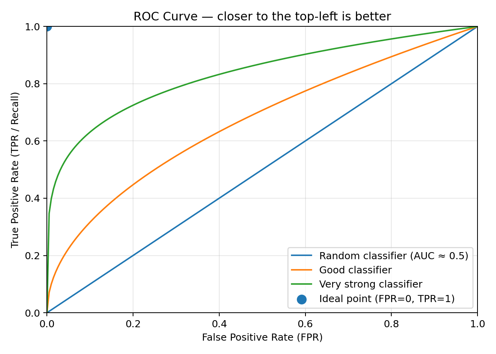
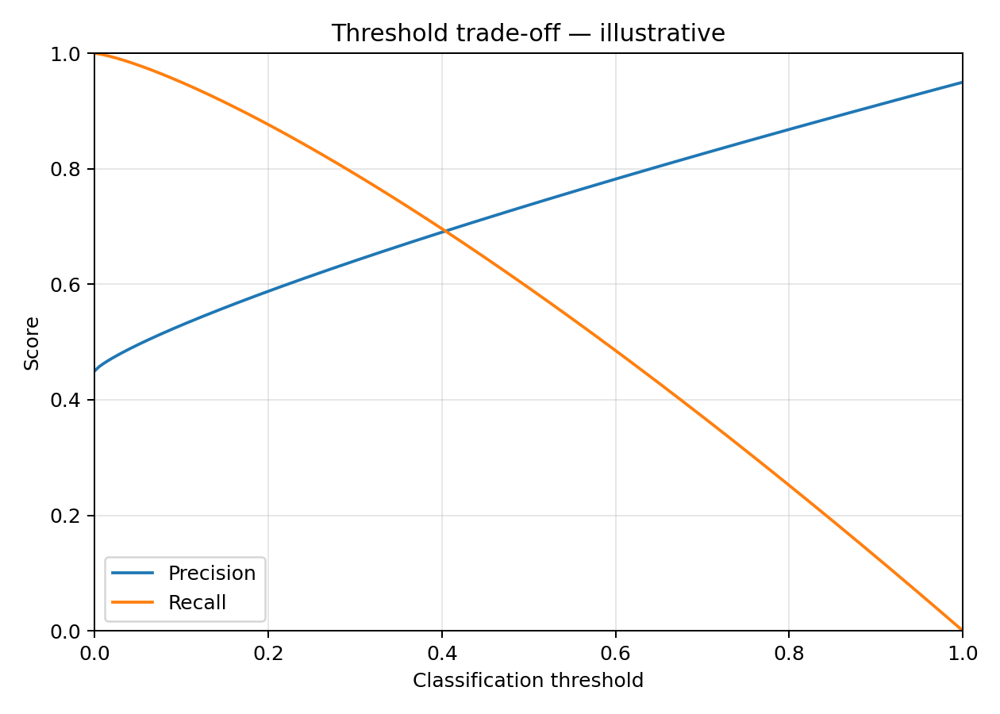

# ML Zoomcamp Module 4 — Classification Evaluation

## 1. Probabilities and Thresholds

A classifier often gives a **probability/score** first.

Example:

`0.82 probability of churn`

Then we choose a threshold:

- probability ≥ threshold → predict `1`
- probability < threshold → predict `0`

A common default is:

`threshold = 0.5`

But `0.5` is **not always the best threshold**.

Changing the threshold changes:

- TP
- TN
- FP
- FN
- Precision
- Recall
- F1

---

## 2. TP / TN / FP / FN

| | Predicted Negative | Predicted Positive |
|---|---:|---:|
| **Actually Negative** | TN ✅ | FP ❌ |
| **Actually Positive** | FN ❌ | TP ✅ |

### Meaning

- **TP — True Positive:** predicted positive, actually positive
- **TN — True Negative:** predicted negative, actually negative
- **FP — False Positive:** predicted positive, actually negative → false alarm
- **FN — False Negative:** predicted negative, actually positive → missed positive

### Easy Memory

- **T / F** → Was the prediction correct?
- **P / N** → What did the model predict?

---

## 3. Confusion Matrix

A confusion matrix contains:

- TN
- FP
- FN
- TP

It shows **what kinds of mistakes** the model makes.

### sklearn

`confusion_matrix()`

---

## 4. Accuracy

> How many predictions were correct overall?

\[
Accuracy = \frac{TP + TN}{TP + TN + FP + FN}
\]

### Problem

Accuracy can be misleading with **imbalanced datasets**.

Example:

- 95 negative
- 5 positive
- model predicts everything as negative

Accuracy = `95%`

But the model detects **zero positives**.

> High accuracy does not necessarily mean a good classifier.

### sklearn

`accuracy_score()`

---

## 5. Precision

> When the model predicts positive, how often is it correct?

\[
Precision = \frac{TP}{TP + FP}
\]

Think:

> **Can I trust a positive prediction?**

High precision → fewer **false positives**.

### sklearn

`precision_score()`

---

## 6. Recall

Also called:

- Sensitivity
- True Positive Rate
- TPR

> Of all actual positives, how many did we find?

\[
Recall = \frac{TP}{TP + FN}
\]

Think:

> **Did we catch the positives?**

High recall → fewer **false negatives**.

### sklearn

`recall_score()`

---

## 7. Precision vs Recall

### Precision

Look at **predicted positives**:

> Of everything I predicted as positive, how many were actually positive?

Main concern:

`FP`

### Recall

Look at **actual positives**:

> Of all real positives, how many did I find?

Main concern:

`FN`

---

## 8. F1 Score

F1 combines **precision and recall**.

\[
F1 =
2 \times
\frac{Precision \times Recall}
{Precision + Recall}
\]

Useful when both precision and recall matter.

It is **not** a simple arithmetic average.

### sklearn

`f1_score()`

---

## 9. Threshold Trade-Off

### Lower Threshold

Predict more samples as positive.

Usually:

- Recall ↑
- Precision ↓

### Higher Threshold

Predict fewer samples as positive.

Usually:

- Precision ↑
- Recall ↓

### Memory

> Lower threshold = catch more positives.

> Higher threshold = be more selective.

The best threshold depends on the **cost of FP vs FN**.

---

## 10. TPR and FPR

### TPR — True Positive Rate

Same as **Recall**.

\[
TPR = \frac{TP}{TP + FN}
\]

> Of all actual positives, how many did we correctly identify?

---

### FPR — False Positive Rate

\[
FPR = \frac{FP}{FP + TN}
\]

> Of all actual negatives, how many did we incorrectly classify as positive?

A good classifier ideally has:

- high TPR
- low FPR

---

## 11. ROC Curve

ROC evaluates the classifier across **many thresholds**.

It plots:

- **x-axis:** FPR
- **y-axis:** TPR

Each threshold creates one point.

Ideal position:

`top-left`

because:

- FPR ≈ 0
- TPR ≈ 1

A random classifier is roughly around the diagonal.

### sklearn

`roc_curve()`

### Main Idea

> ROC shows the trade-off between catching positives and producing false positives at different thresholds.

---

## 12. AUC / ROC-AUC

AUC means:

> **Area Under the ROC Curve**

It summarizes the ROC curve using one number.

| AUC | Rough Meaning |
|---:|---|
| `1.0` | Perfect |
| `0.9` | Very strong |
| `0.8` | Good |
| `0.7` | Moderate |
| `0.5` | Random |
| `< 0.5` | Worse than random |

Another useful interpretation:

> AUC measures how well the model ranks positive examples above negative examples.

### sklearn

`roc_auc_score()`

For calculating an area manually:

`auc()`

---

## 13. ROC vs AUC

- **ROC** → curve
- **AUC** → number summarizing the curve

Think:

> ROC shows behavior across thresholds.

> AUC makes models easier to compare.

---

## 14. Why AUC Is Useful

AUC does not require choosing one specific classification threshold first.

It measures how well the model separates/ranks positive and negative examples.

Example:

- Model A: AUC = `0.78`
- Model B: AUC = `0.85`

Model B separates positive and negative samples better overall.

---

## 15. Class Imbalance

Example:

- 98% negative
- 2% positive

Accuracy may become misleading.

Look at:

- confusion matrix
- precision
- recall
- F1
- ROC-AUC

Which metric matters most depends on the problem.

### If False Negatives Are Expensive

Focus more on:

- Recall
- FN

Example:

Missing a disease or fraud case.

### If False Positives Are Expensive

Focus more on:

- Precision
- FP

Example:

Sending expensive interventions to incorrectly flagged users.

---

## 16. Cross-Validation

One train-validation split may be lucky or unlucky.

Cross-validation evaluates the model on several different splits.

### Example: 5-Fold Cross-Validation

Split the dataset into 5 parts.

Each time:

- train on 4 parts
- validate on 1 part

Repeat until every part has been used for validation.

Then calculate something like:

`AUC = mean ± std`

Example:

`0.84 ± 0.02`

Meaning:

- average AUC ≈ `0.84`
- variation between folds ≈ `0.02`

Smaller standard deviation usually means more stable evaluation.

### sklearn

`KFold()`

Useful convenience function:

`cross_val_score()`

---

## 17. Typical Classification Evaluation Workflow

```text
Train classifier
      ↓
Get predicted probabilities
      ↓
Check ROC-AUC
      ↓
Choose threshold if needed
      ↓
Convert probabilities → 0 / 1
      ↓
Confusion matrix
      ↓
Accuracy / Precision / Recall / F1
      ↓
Cross-validation
      ↓
Report mean ± std
```

---

## 18. sklearn Functions Worth Remembering

| Need | sklearn |
|---|---|
| Predicted probabilities | `predict_proba()` |
| Accuracy | `accuracy_score()` |
| Confusion matrix | `confusion_matrix()` |
| Precision | `precision_score()` |
| Recall | `recall_score()` |
| F1 | `f1_score()` |
| ROC curve | `roc_curve()` |
| ROC-AUC | `roc_auc_score()` |
| Area under curve | `auc()` |
| K-fold CV | `KFold()` |
| CV convenience | `cross_val_score()` |

---

# Ultra-Short Recall Version

```text
TP = correctly predicted positive
TN = correctly predicted negative
FP = false alarm
FN = missed positive

Accuracy = correct / all

Precision = TP / (TP + FP)
"When I say positive, am I right?"

Recall = TP / (TP + FN)
"Did I find the positives?"

F1 = combines precision + recall

TPR = Recall
FPR = FP / (FP + TN)

ROC = TPR vs FPR across thresholds
AUC = area under ROC
0.5 ≈ random
1.0 = perfect

Lower threshold:
↑ recall
usually ↓ precision

Higher threshold:
↑ precision
usually ↓ recall

Imbalanced data:
do not trust accuracy alone

Cross-validation:
evaluate on multiple folds
→ report mean ± std
```

## Visual Memory Aids

### 1. Confusion Matrix

```text
                    PREDICTED
               Negative       Positive
          ┌─────────────┬─────────────┐
Actual -  │     TN      │     FP      │
          │   correct   │ false alarm │
          ├─────────────┼─────────────┤
Actual +  │     FN      │     TP      │
          │   missed    │   correct   │
          └─────────────┴─────────────┘
```

- `TP` = correctly predicted positive
- `TN` = correctly predicted negative
- `FP` = false alarm
- `FN` = missed positive

---

### 2. ROC / AUC Intuition



- **x-axis = FPR**
- **y-axis = TPR / Recall**
- Closer to the **top-left** is better.
- The diagonal line is roughly a **random classifier**.
- **AUC** = area under the ROC curve.
  - `0.5` ≈ random
  - `1.0` = perfect

> Best case: **high TPR + low FPR**

---

### 3. Threshold vs Precision / Recall



Changing the classification threshold changes the balance between precision and recall.

- **Lower threshold**  
  → more positive predictions  
  → recall usually ↑  
  → precision often ↓

- **Higher threshold**  
  → fewer positive predictions  
  → precision often ↑  
  → recall usually ↓

> Choose the threshold based on whether **false positives** or **false negatives** are more costly.